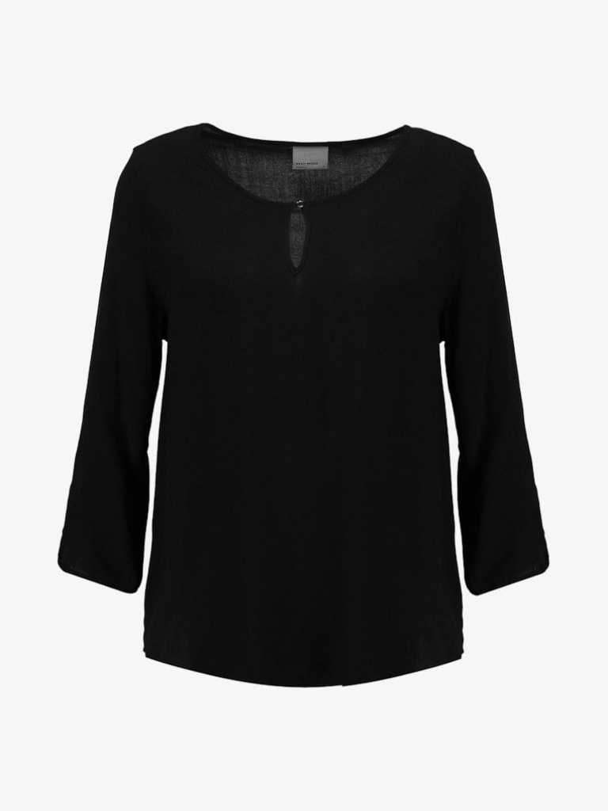
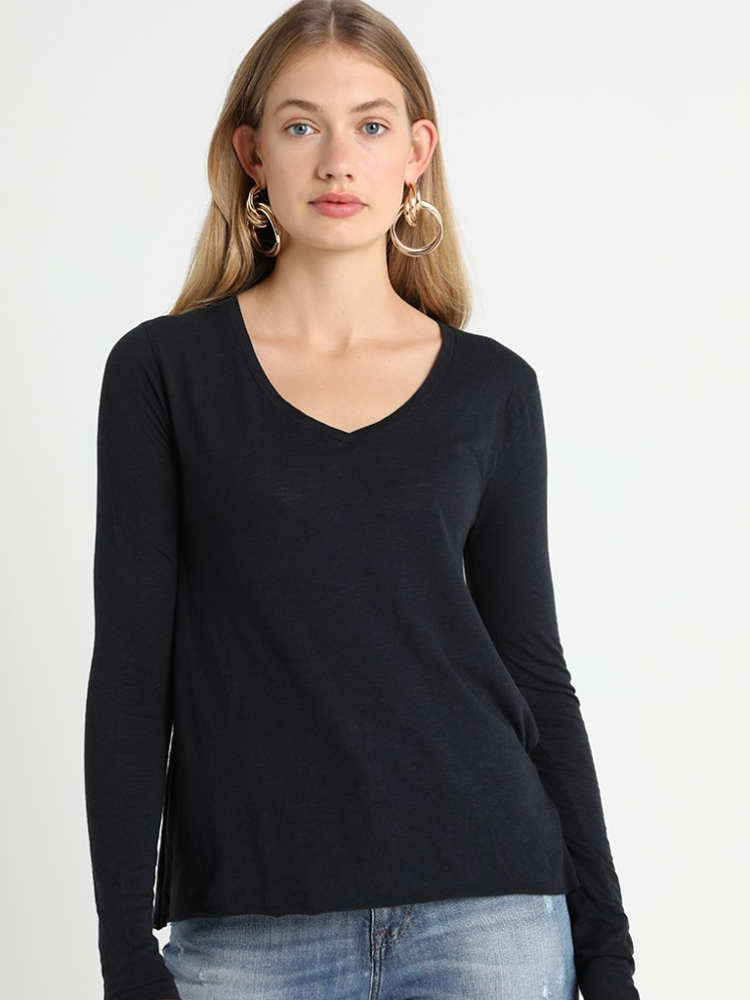
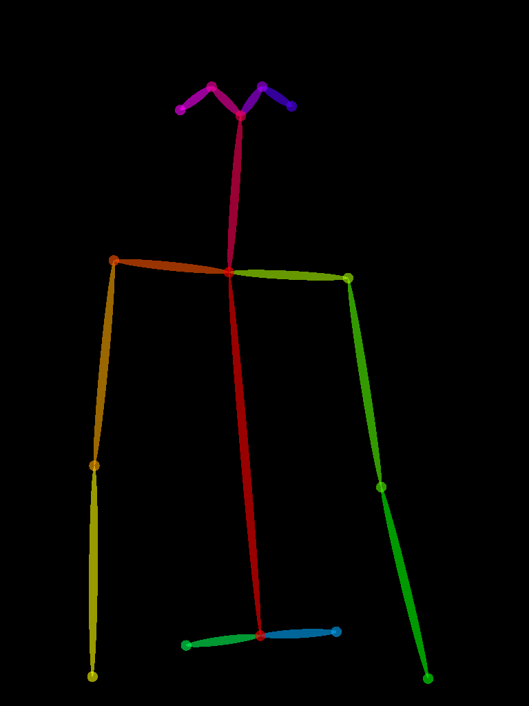
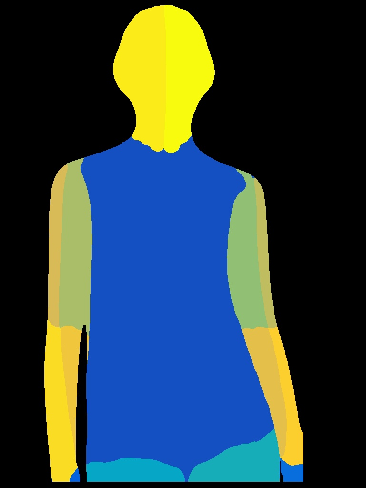
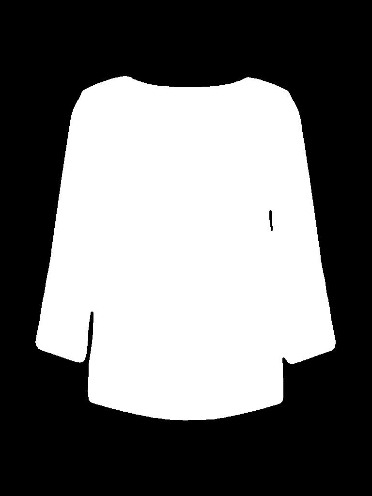
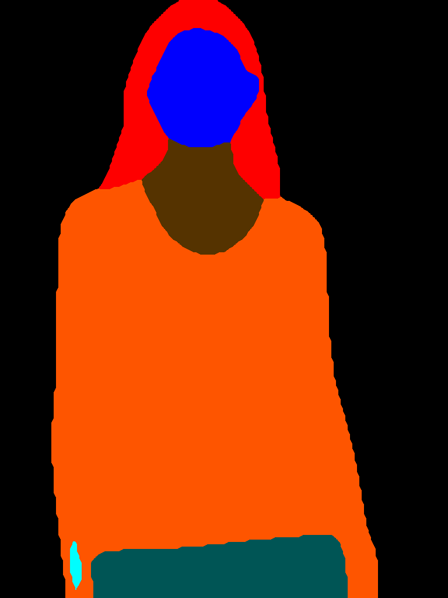
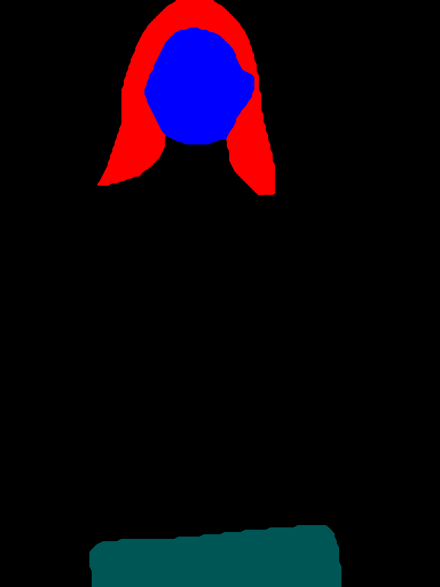
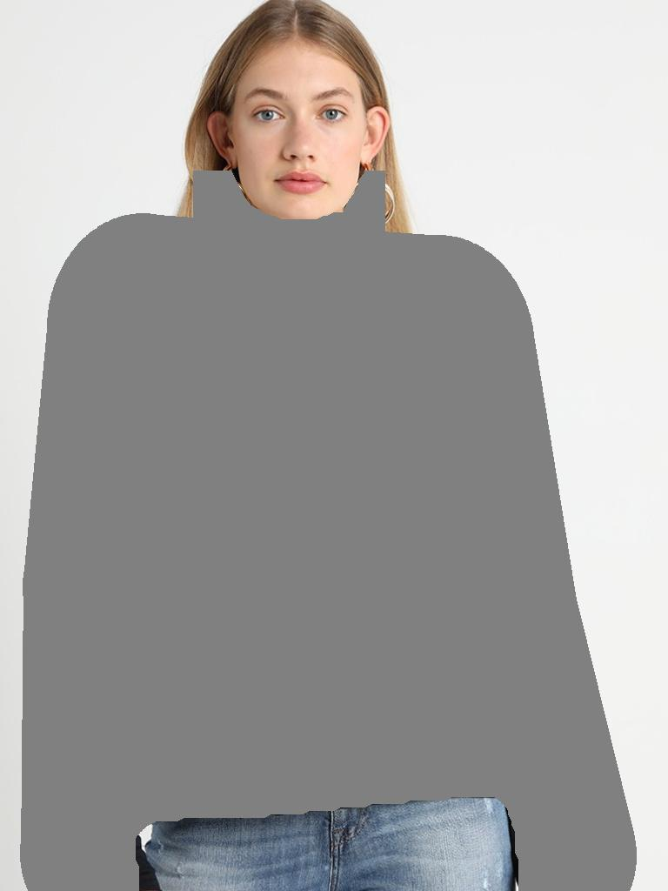

# VASTRA Preprocessing Pipeline

This repository contains the preprocessing pipeline for preparing data compatible with **HR-VITON** and similar virtual try-on models. The pipeline includes the following stages:

- OpenPose Keypoint Extraction
- DensePose UV Mapping
- Cloth Mask Generation
- Human Parsing
- Parse Agnostic Map
- Human Agnostic Image

---

## Requirements

You can get started quickly by setting up a Conda environment with the following commands:

```bash
conda create -n hrviton-preprocess python=3.9.13 -y
conda activate hrviton-preprocess
conda install pytorch torchvision torchaudio cpuonly -c pytorch
pip install transformers tqdm matplotlib Pillow numpy opencv-python
```

This will install all the necessary packages including:
- `transformers`
- `tqdm`
- `matplotlib`
- `Pillow`
- `numpy`
- `opencv-python`

No need to mess with a `requirements.txt` — just copy and paste the above commands into your terminal and you're good to go!
My setup uses GPU Based Pipeline, so change your scripts slightly to ensure normal working with CPU.

This will be our inputs :




---

## 1. OpenPose Keypoint Generation

Generate human pose keypoints for each input image using [OpenPose](https://github.com/CMU-Perceptual-Computing-Lab/openpose).

### Installation & Inference

1. Clone OpenPose:
   ```bash
   git clone https://github.com/CMU-Perceptual-Computing-Lab/openpose.git
   ```
2. Follow the [official installation guide](https://github.com/CMU-Perceptual-Computing-Lab/openpose/blob/master/doc/installation/0_index.md).

3. Generate keypoints:
   ```bash
   bin\OpenPoseDemo.exe --image_dir "images" ^
   More? --write_images "output" ^
   More? --write_json "json_output" ^
   More? --display 0 ^
   More? --render_pose 2 ^
   More? --disable_blending true ^
   More? --net_resolution "-1x368"
   ```

---




## 2. DensePose UV Mapping

Use Facebook's [DensePose](https://github.com/facebookresearch/DensePose) to get UV coordinates of the human body.

### Installation & Inference

1. Install the models, requirements and configs listed in the directory and place them in their respective folders.
2. Run this command : 


   ```bash
   python convert_image.py --input "assets\{name_of_input_image}" --out "output\{name_of_output_image}"
   ```

---




## 3. Cloth Masking

Cloth masks are generated using BRIAAI's RMBG-1.4 background remover. Script is given in the Cloth Masking directory. Directly run the script. Adjust the script as per your input directory as the directories have been hardcoded.



---

## 4. Human Parsing

Human parsing should be done using models like [Self-Correction Human Parsing (SCHP)](https://github.com/Engineering-Course/Self-Correction-Human-Parsing) or any other fine-tuned parser compatible with the LIP dataset.

- Download pre-trained weights and run inference for all images in `datasets/images/`.
- Save parsing outputs in `test/image-parse-v3/`.



---

## 5. Parse Agnostic Generation

Generates a modified human parse by masking upper body, arms, and neck using pose keypoints.

### Run script:

```bash
python parse_agnostic.py
```

Check the full implementation in `parse_agnostic.py`.



---

## 6. Human Agnostic Generation

Generates an image with body parts removed (arms, torso, neck) while retaining the head and lower body.

### Run script:

```bash
python human-agnostic.py
```

Check full implementation in `human-agnostic.py`.



---

## Output Directory Structure

After preprocessing, expect the following structure:

```
data/
├── test/
│   ├── openpose_json/
│   ├── openpose_img/
│   ├── image-densepose/
│   ├── cloth-mask/
│   ├── image-parse-v3/
│   ├── image-parse-agnostic-v3.2/
│   └── agnostic-v3.2/
```

---

## Tips

- Ensure images are resized or processed to 768×1024 for consistency.
- You may use `resize()` methods to normalize dimensions in PIL.
- Parse IDs (labels) are crucial – refer to the Human Parsing Label Map used in LIP dataset.

---

## References

- [OpenPose GitHub](https://github.com/CMU-Perceptual-Computing-Lab/openpose)
- [DensePose GitHub](https://github.com/facebookresearch/DensePose)
- [BRIA RMBG](https://huggingface.co/briaai/RMBG-1.4)
- [Human Parsing (CIHP/SCHP)](https://github.com/Engineering-Course/Self-Correction-Human-Parsing)

