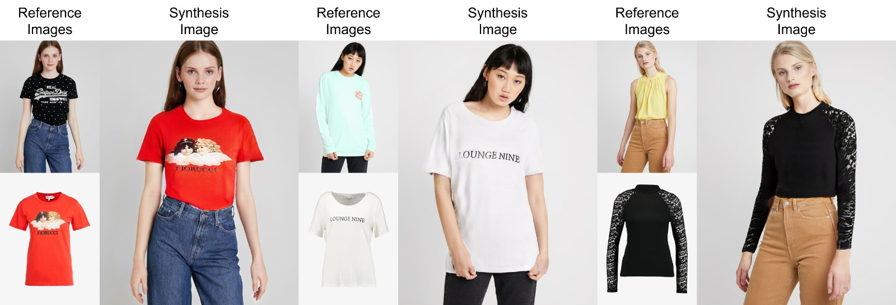

# VASTRA: Virtual Apparel Simulation for Try-on and Realistic Augmentation

**VASTRA** is a virtual try-on pipeline inspired by [HR-VITON](https://github.com/sangyun884/HR-VITON), allowing users to simulate clothes on human models using deep learning. This project leverages pre-trained HR-VITON models to generate realistic outputs from a person's image and a target clothing image.

> ⚠️ This project uses pre-trained models from the HR-VITON repository, which is licensed under CC BY-NC 4.0. Hence, this project is strictly **non-commercial**.

---

## Repository Structure

### 1. `Preprocessing/`
Contains all the preprocessing scripts required to generate the necessary inputs (segmentation, pose, cloth-mask, warped cloth, etc.) for inference.

- 🔧 **Note:** OpenPose is required but **not included** in this repo. You must install OpenPose separately in your system.
- All other preprocessing scripts (including agnostic parsing and cloth mask generation) are self-contained and can be run directly.

### 2. `Inference/`
This is the main folder where the try-on inference happens. It utilizes the pre-trained HR-VITON models to produce the final outputs using the preprocessed inputs.

### 3. `Sample Datasets/`
To help users test the pipeline without going through preprocessing steps, this folder includes a few samples from the **official HR-VITON dataset**. The visualized parsing images are provided for reference, but users must use **grayscale parsing masks** for actual inference.

---

## Quick Start (for Sample Testing)
If you’re facing difficulty generating preprocessed data, you can directly use the files in the `Sample Datasets` folder to run inference and observe the results.

---

## License and Use

This project is strictly for **academic or research purposes only**. Since it builds upon HR-VITON, which is under the [Creative Commons Attribution-NonCommercial 4.0 License](https://creativecommons.org/licenses/by-nc/4.0/), **commercial use is not permitted**.

---

## Acknowledgements

- [HR-VITON](https://github.com/sangyun884/HR-VITON): The base implementation used for inference and pretrained models.

---

## Project Facts

- The original HR-VITON models used in this project were trained on the **VITON-HD** dataset, which includes high-resolution image pairs of people and clothes.
- The training process was computationally intensive and required powerful hardware:
  - **GPU Used**: NVIDIA Tesla V100 / A100 (as per official paper indications).
  - **Training Duration**: Approximately **4–6 days** on a single high-end GPU setup.
- The architecture combines **Geometric Matching Module (GMM)** and **Try-on Module (TOM)**, each responsible for garment warping and realistic image generation respectively.
- All inference in this project is done using **pre-trained models** — no additional training is required.
- The project supports **modular preprocessing and inference**, making it suitable for both research experiments and hackathon demos.

---

Feel free to raise issues or pull requests if you'd like to improve or contribute!
